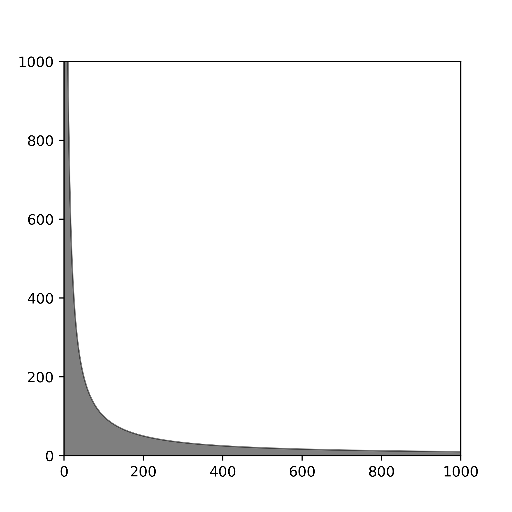
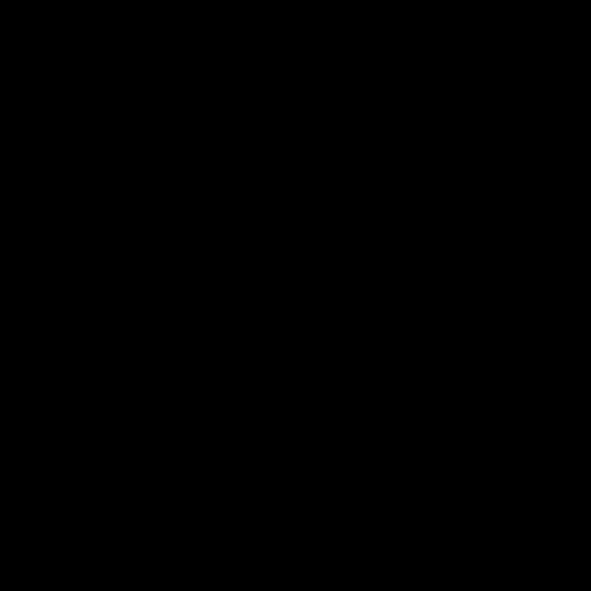
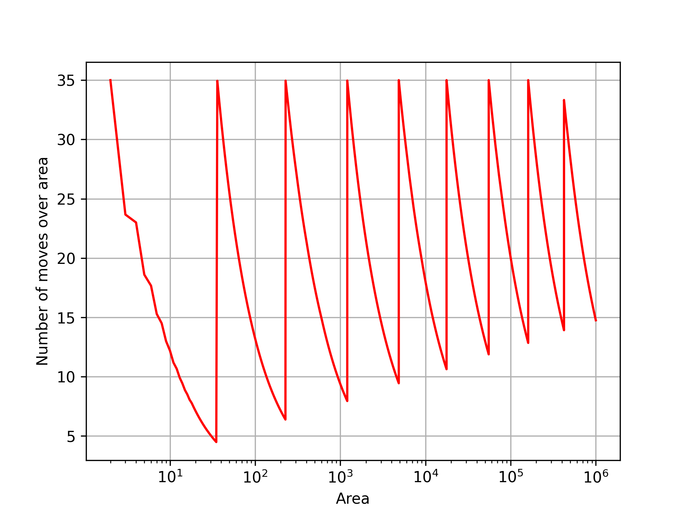
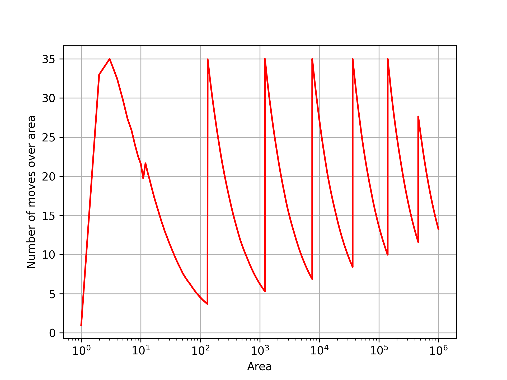
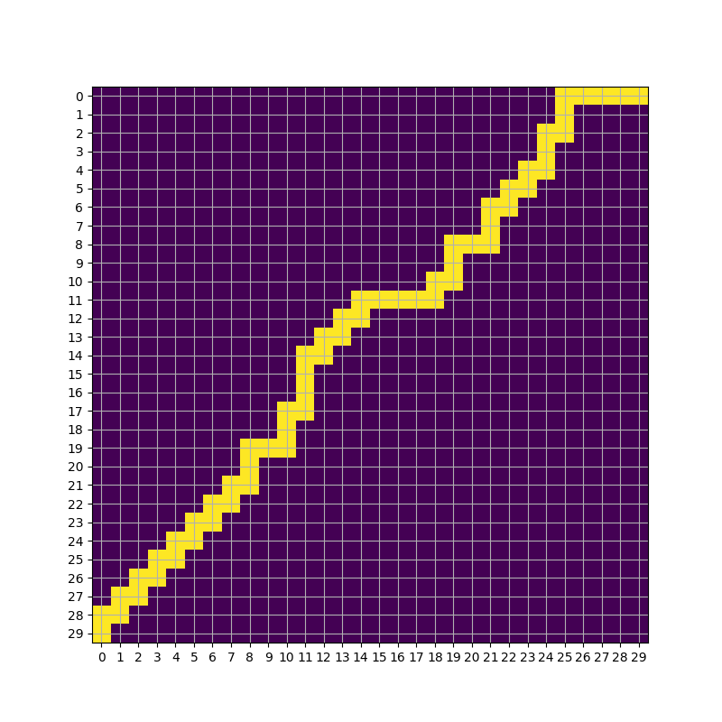
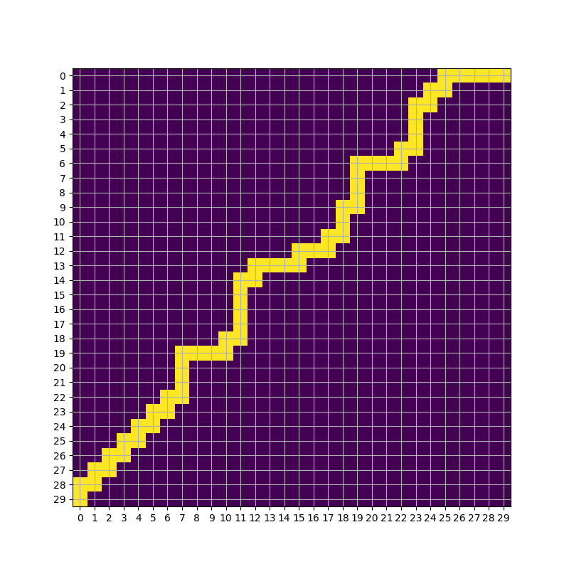
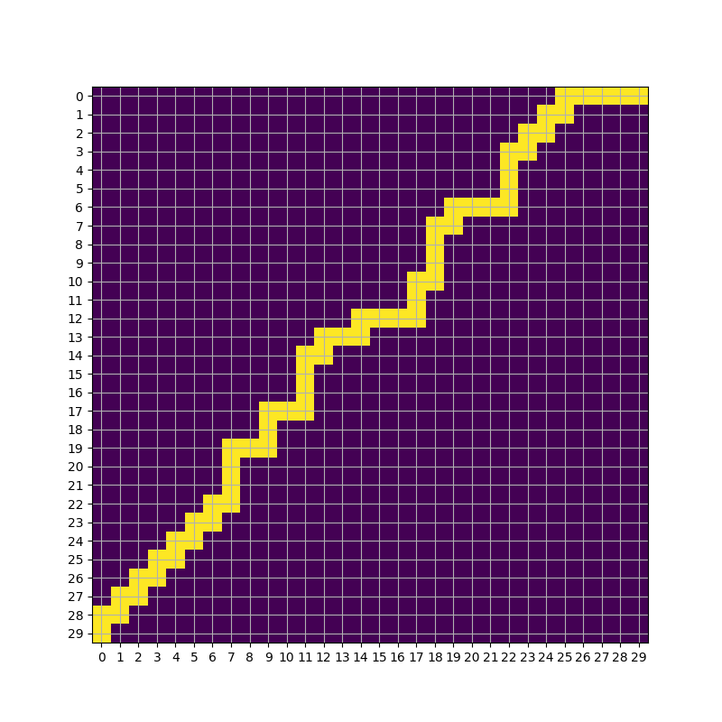

# JetBrainsInternshipBlindSnake

# Task goal
The problem involves a variant of the classic Snake game where the player is unaware of the dimensions of the game world, nor the positions of the snake or food. When the snake crosses the boundaries of the world, it is wrapped around to the opposite side. The goal is to develop a pathfinding algorithm that systematically explores the space, ensuring that all possible worlds with an area of $10^6$ or less are fully covered in under $35 * S$ moves, where $S$ represents the area of the specific world.

# O(SlogS) approach
## Pathfinding Algorithm for Snake Game

In this problem, for a given maximum area $S$, all possible worlds are confined under the curve $y=S/x$, with boundaries at $y = S$ and $x=S$. In the continuous space, the area under this curve is given by $S(1 + lnS)$. For the maximum area of $10^6$, the required number of moves is approximately $N = 14,815,510$, which is well below the allowed limit of $35,000,000$ moves.

  

### Filling the Space

To satisfy this rule for every possible area, the filling process starts from the origin and fills the area under the curve $y=S/x$ while incrementing $S$ up to the maximum limit of $10^6$. Achieving this in discrete space, with the movement pattern resembling that of a snake, is challenging. 

### Pathfinding Strategy

The pathfinding strategy I developed involves filling the area under the curve row by row, moving up and back down. In each pass, the area is incremented as much as possible, while still ensuring that each cell is visited in no more than $35*S$ moves.

  

The following graph plots the ratio of necessary moves to area on a logarithmic scale. Notice that the graph never exceeds $35$, and the valleys are increasing. This suggests that at some point, for larger values of $S$, the algorithm will break down.

  

## Optimization
Due to tiling it's possible to fill an area between two curves $y=S_1/x$ and $y=S_2/x$ where $S_2 = 0.5*(\sqrt5 - 1)S_1$ and still include all possible world sizes. To ensure the priority of cells it's necessary to due multiple of these filling passes with increasing $S_1$ and $S_2$. In the end the total number of used moves is $N=13,237,069$ which is a marginal improvement.

  

# O(S) approach

Through some testing, it appears that it is possible to find a path that increases linearly with $S$, specifically a path that spans $2S - 1$ cells. The following examples illustrate paths that satisfy the requirements for a maximum area of 30.

  

  

  

All paths begin at one corner and end at the opposite corner of a square with edge length $S$. This is crucial for covering extreme aspect ratios, such as $S \times 1$ and $1 \times S$.

These paths were discovered using a brute-force approach, and so far, I have not been able to identify any patterns for creating paths with linear complexity for larger values of $S$.

One regularity that I noticed is that there always seems to be a path that is contained within limits of main diagonal and $\sqrt S$-th diagonal. This was used in order to speed up the brute-force approach.

# Scripts
[`game_state.py`](game_state.py) defines a class for tracking state and implementing logic.

[`pathing.py`](pathing.py) defines pathing algorithms mentioned above.

[`bruteforce.py`](bruteforce.py) is used for finding linear solutions using brute-force approach.

[`utils.py`](utils.py) defines some functions for checking wheter certain path fills all possible world sizes. It also defines a function `priority_map` that creates a 2d array that shows how many cells, originating from different world sizes, would be filled by filling a specific cell in absolute coordinates (non-tiled).

[`tiling_visualization.py`](tiling_visualization.py) is used to show how optimized $O(SlogS)$ approach works by tiling areas between curves $y=S_1/x$ and $y=S_2/x$.

[`plots.py`](plots.py) is used to plot the ratios of used moves over area.

[`visualization.py`](visualization.py) uses pygame and OpenGL to simulate and render definded algorithms.

[`priority_map_visualization.py`](priority_map_visualization.py) uses pygame to render priority map based on a specified path. The simulation is interactive, allowing user to select and deselect specific cells in the absolute world and see how they reflect on priority map. When priority map shows all zeros than all worlds with area less than specified are filled.

